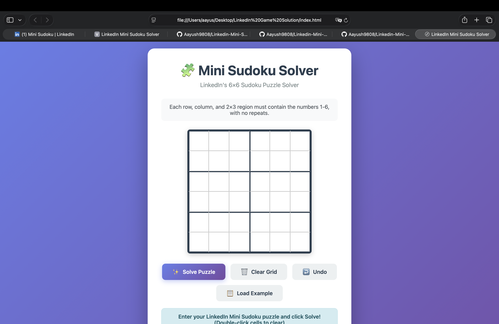
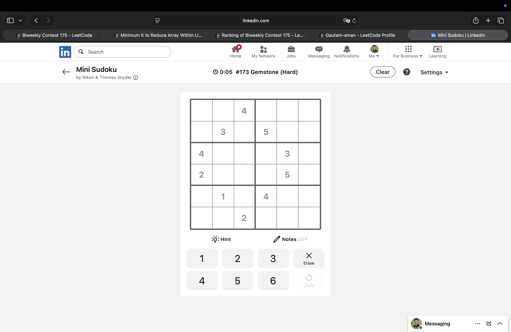
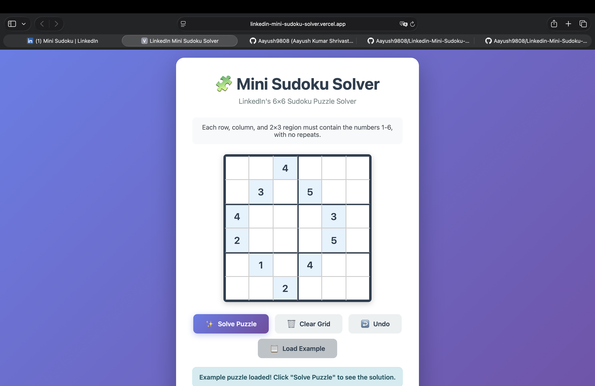
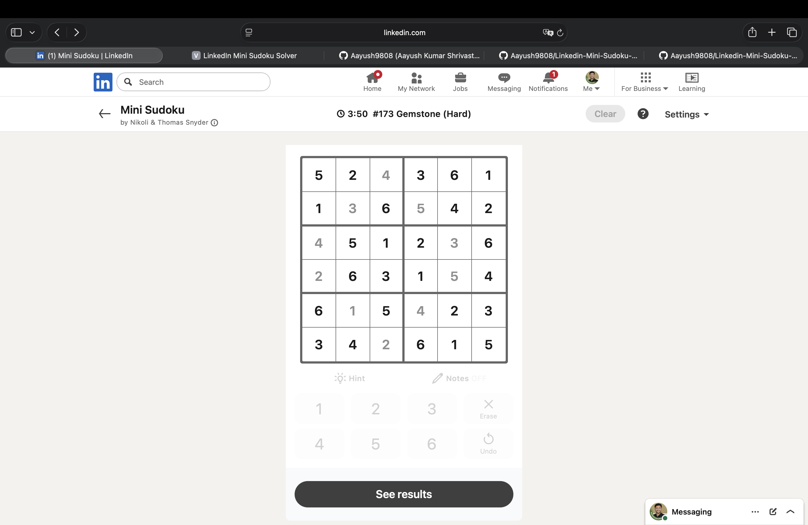
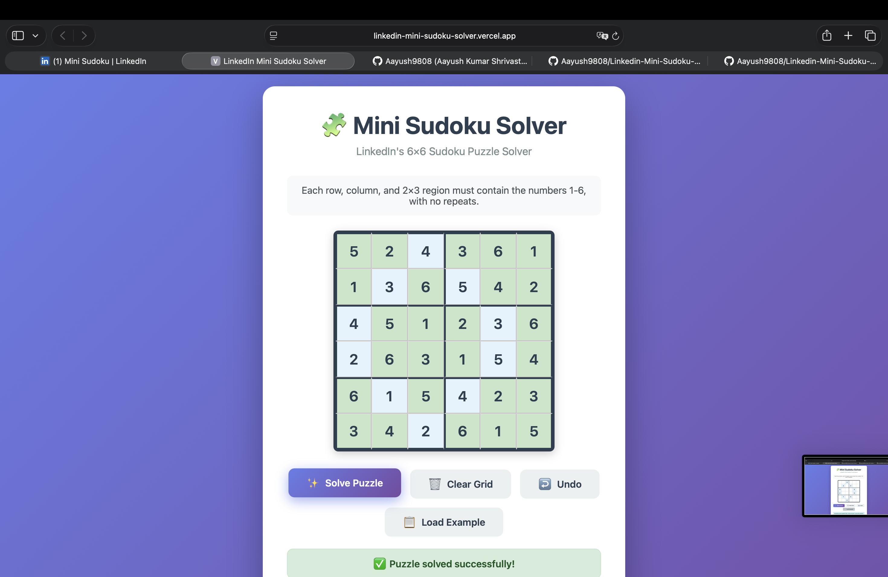
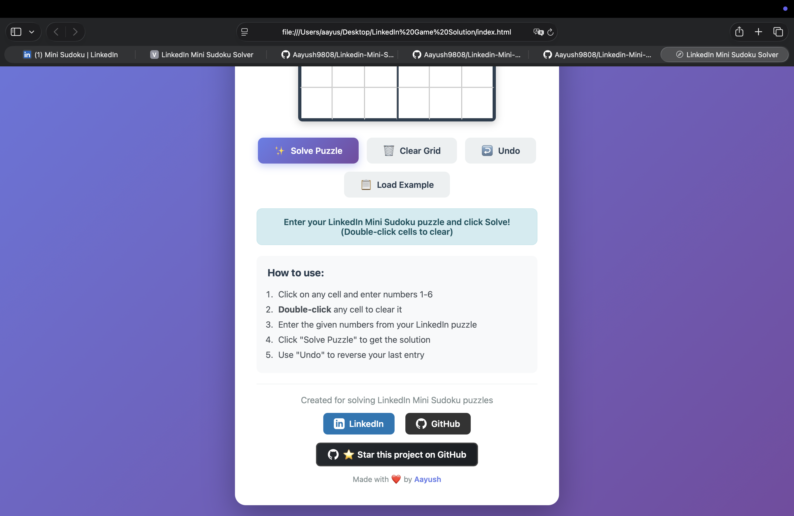

# 🧩 LinkedIn Mini Sudoku Solver

<div align="center">

A beautiful, fast, and intuitive web application to solve LinkedIn's 6×6 Mini Sudoku puzzles instantly! Built with vanilla HTML, CSS, and JavaScript.

**🌐 Live Demo:** [https://linkedin-mini-sudoku-solver.vercel.app](https://linkedin-mini-sudoku-solver.vercel.app)

[](https://github.com/Aayush9808/Linkedin-Mini-Sudoku-Solver/stargazers)
[](https://github.com/Aayush9808/Linkedin-Mini-Sudoku-Solver/network/members)


</div>

---

## ✨ Features

- 🎯 **6×6 Grid Layout** - Matches LinkedIn's Mini Sudoku format
- 🚀 **Instant Solving** - Uses backtracking algorithm
- 🎨 **Beautiful UI** - Clean, modern interface
- ⌨️ **Keyboard Navigation** - Arrow keys to move between cells
- ✅ **Input Validation** - Only accepts numbers 1-6
- 📱 **Responsive Design** - Works on mobile and desktop
- 🎲 **Example Puzzle** - Try it out with a pre-loaded puzzle
- ↩️ **Undo Feature** - Reverse your last entry
- 🖱️ **Double-click Clear** - Quickly clear any cell

## 📸 Screenshots

### Initial Screen


### Puzzle Input (LinkedIn Format)
<p align="center">
  
  
</p>

### Solved Puzzle
<p align="center">
  
  
</p>

### Features & Instructions


## 🚀 Quick Start

### Local Development

1. Clone or download this repository
2. Open `index.html` in your web browser
3. That's it! No build process required.

```bash
# Open in browser (macOS)
open index.html

# Or just double-click the index.html file
```

## 🌐 Deployment Options

### Option 1: Vercel (Recommended - Fastest)

1. Go to [Vercel](https://vercel.com/)
2. Sign up for a free account
3. Click "Add New" → "Project"
4. Import your GitHub repository
5. Click "Deploy" - Done! 🎉

**Or use Vercel CLI:**
```bash
npm install -g vercel
vercel --prod
```

### Option 2: Netlify

1. Go to [Netlify](https://www.netlify.com/)
2. Sign up for a free account
3. Drag and drop your project folder onto Netlify Dashboard
4. Your site is live! 🎉

**Or use Netlify CLI:**
```bash
npm install -g netlify-cli
netlify deploy --prod
```

### Option 3: GitHub Pages

1. Create a GitHub repository
2. Push your code:
```bash
git init
git add .
git commit -m "Initial commit"
git branch -M main
git remote add origin https://github.com/yourusername/mini-sudoku-solver.git
git push -u origin main
```

3. Go to repository Settings → Pages
4. Select `main` branch as source
5. Your site will be live at: `https://yourusername.github.io/mini-sudoku-solver/`

### Option 4: Cloudflare Pages

1. Go to [Cloudflare Pages](https://pages.cloudflare.com/)
2. Sign up and connect your GitHub
3. Select your repository
4. Deploy with one click! ⚡

## 🎮 How to Use

1. **Enter Puzzle**: Click on cells and enter numbers 1-6 from your LinkedIn puzzle
2. **Double-click**: Double-click any cell to clear it quickly
3. **Solve**: Click the "Solve Puzzle" button to get instant solution
4. **Undo**: Made a mistake? Use the Undo button
5. **Clear**: Reset the entire grid with Clear Grid button
6. **Example**: Load a sample puzzle to test the solver

### Keyboard Shortcuts

- **Arrow Keys**: Navigate between cells (↑ ↓ ← →)
- **1-6**: Enter numbers
- **Backspace/Delete**: Clear cell
- **Double-click**: Clear cell quickly

## 🎮 Example Puzzle

The "Load Example" button loads the puzzle shown in the instructions:
```
_ _ 4 _ _ _
_ 3 _ 5 _ _
4 _ _ _ 3 _
2 _ _ _ 5 _
_ 1 _ 4 _ _
_ _ 2 _ _ _
```

## 🧠 Algorithm

The solver uses a **backtracking algorithm** with the following approach:

1. Find an empty cell in the 6×6 grid
2. Try numbers 1-6 in that cell
3. Check if the number is valid:
   - ✅ No duplicates in the same row
   - ✅ No duplicates in the same column
   - ✅ No duplicates in the same 2×3 region
4. If valid, place it and move to next empty cell
5. If stuck, backtrack and try a different number
6. Repeat until solved or proven unsolvable

**Time Complexity**: O(6^n) where n is the number of empty cells  
**Space Complexity**: O(36) for the 6×6 grid  
**Average Solve Time**: < 10ms ⚡

## 📁 Project Structure

```
mini-sudoku-solver/
├── index.html      # Main HTML structure
├── style.css       # Styling and animations
├── script.js       # Sudoku solver logic
└── README.md       # This file
```

## 🎨 Customization

### Change Colors

Edit `style.css`:
```css
/* Main gradient background */
background: linear-gradient(135deg, #667eea 0%, #764ba2 100%);

/* Given numbers color */
.cell.given {
    background: #e3f2fd;
    color: #0066cc;
}

/* Solved numbers color */
.cell.solved {
    background: #c8e6c9;
}
```

## 🐛 Troubleshooting

**Puzzle won't solve?**
- Make sure all entered numbers are correct
- Check for duplicate numbers in rows/columns/regions
- Verify the puzzle has a valid solution

**UI looks broken?**
- Clear your browser cache
- Try a different browser
- Check console for errors (F12)

## 📝 License

This project is open source and available for personal and educational purposes.

## 🤝 Contributing

Contributions are welcome! Some ideas:
- ⏱️ Add timer functionality
- 💾 Save/load puzzles from localStorage
- 📊 Difficulty indicator
- 🎬 Step-by-step solution visualization
- 📚 Multiple puzzle templates
- 🌐 Multi-language support

**Steps to contribute:**
1. Fork the repository
2. Create your feature branch (`git checkout -b feature/AmazingFeature`)
3. Commit your changes (`git commit -m 'Add some AmazingFeature'`)
4. Push to the branch (`git push origin feature/AmazingFeature`)
5. Open a Pull Request

## 🌟 Show Your Support

If this project helped you solve LinkedIn puzzles faster, give it a ⭐️!

## 📞 Contact

**Aayush Kumar Shrivastav**

- LinkedIn: [@aayush2209](https://www.linkedin.com/in/aayush2209)
- GitHub: [@Aayush9808](https://github.com/Aayush9808)
- Email: ashrivastav2209@gmail.com

---

<div align="center">

**Made with ❤️ for LinkedIn Mini Sudoku enthusiasts**

Remember: Every LinkedIn Mini Sudoku puzzle has a unique solution! 🎯

[⬆ Back to Top](#-linkedin-mini-sudoku-solver)

</div>
